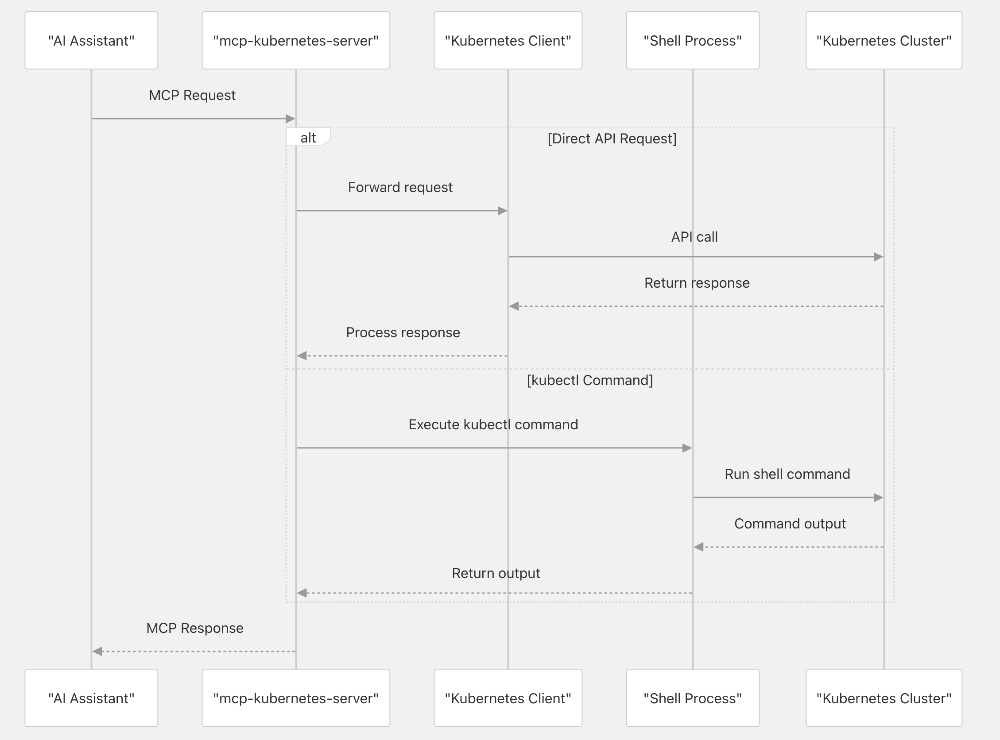

# mcp-kubernetes

The mcp-kubernetes is a Model Context Protocol (MCP) server that enables AI assistants to interact with Kubernetes clusters. It serves as a bridge between AI tools (like Claude, Cursor, and GitHub Copilot) and Kubernetes, translating natural language requests into Kubernetes operations and returning the results in a format the AI tools can understand.

It allows AI tools to:

- Query Kubernetes resources
- Execute kubectl commands
- Manage Kubernetes clusters through natural language interactions
- Diagnose and interpret the states of Kubernetes resources

## How it works



## How to install

### Docker

Get your kubeconfig file for your Kubernetes cluster and setup in the mcpServers (replace src path with your kubeconfig path):

```json
{
  "mcpServers": {
    "kubernetes": {
      "command": "docker",
      "args": [
        "run",
        "-i",
        "--rm",
        "--mount", "type=bind,src=/home/username/.kube/config,dst=/home/mcp/.kube/config",
        "ghcr.io/azure/mcp-kubernetes"
      ]
    }
  }
}
```

### Local

<details>

<summary>Install kubectl</summary>

Install [kubectl](https://kubernetes.io/docs/tasks/tools/) if it's not installed yet and add it to your PATH, e.g.

```bash
# For Linux
curl -LO "https://dl.k8s.io/release/$(curl -L -s https://dl.k8s.io/release/stable.txt)/bin/linux/amd64/kubectl"

# For MacOS
curl -LO "https://dl.k8s.io/release/$(curl -L -s https://dl.k8s.io/release/stable.txt)/bin/darwin/arm64/kubectl"
```

</details>

<details>
<summary>Install helm</summary>

Install [helm](https://helm.sh/docs/intro/install/) if it's not installed yet and add it to your PATH, e.g.

```bash
curl -sSL https://raw.githubusercontent.com/helm/helm/main/scripts/get-helm-3 | bash
```

</details>

<br/>

Config your MCP servers in [Claude Desktop](https://claude.ai/download), [Cursor](https://www.cursor.com/), [ChatGPT Copilot](https://marketplace.visualstudio.com/items?itemName=feiskyer.chatgpt-copilot), [Github Copilot](https://github.com/features/copilot) and other supported AI clients, e.g.

```json
{
  "mcpServers": {
    "kubernetes": {
      "command": "<path of binary 'mcp-kubernetes'>",
      "args": [
        "--transport",
        "stdio"
      ],
      "env": {
        "KUBECONFIG": "<your-kubeconfig-path>"
      }
    }
  }
}
```

### Options

Environment variables:

- `KUBECONFIG`: Path to your kubeconfig file, e.g. `/home/<username>/.kube/config`.

Command line arguments:

```sh
Usage of ./mcp-kubernetes:
      --access-level string       Access level (readonly, readwrite, or admin) (default "readonly")
      --additional-tools string   Comma-separated list of additional tools to support (kubectl is always enabled). Available: helm,cilium
      --allow-namespaces string   Comma-separated list of namespaces to allow (empty means all allowed)
      --host string               Host to listen for the server (only used with transport sse or streamable-http) (default "127.0.0.1")
      --port int                  Port to listen for the server (only used with transport sse or streamable-http) (default 8000)
      --timeout int               Timeout for command execution in seconds, default is 60s (default 60)
      --transport string          Transport mechanism to use (stdio, sse or streamable-http) (default "stdio")
```

### Access Levels

The `--access-level` flag controls what operations are allowed:

- **`readonly`** (default): Only read operations are allowed (get, describe, logs, etc.)
- **`readwrite`**: Read and write operations are allowed (create, delete, apply, etc.)
- **`admin`**: All operations are allowed, including admin operations (cordon, drain, taint, etc.)

Example configurations:

```json
// Admin access
{
  "mcpServers": {
    "kubernetes": {
      "command": "mcp-kubernetes", 
      "args": ["--access-level", "admin"]
    }
  }
}
```

## Usage

Ask any questions about Kubernetes cluster in your AI client, e.g.

```txt
What is the status of my Kubernetes cluster?

What is wrong with my nginx pod?
```

## Available Tools

The mcp-kubernetes server provides the following tools for interacting with Kubernetes clusters:

<details>

<summary> Read-Only Tools </summary>

#### Read-Only Tools

- `kubectl_get`: Get Kubernetes resources
- `kubectl_describe`: Show detailed information about Kubernetes resources
- `kubectl_explain`: Get documentation for Kubernetes resources
- `kubectl_logs`: Print logs from containers in pods
- `kubectl_api_resources`: List available API resources
- `kubectl_api_versions`: List available API versions
- `kubectl_diff`: Show differences between current state and applied changes
- `kubectl_cluster_info`: Display cluster information
- `kubectl_top`: Display resource usage (CPU/Memory)
- `kubectl_events`: List events in the cluster
- `kubectl_auth`: Inspect authorization settings

</details>

<details>

<summary> Read-Write Tools </summary>

#### Read-Write Tools

- `kubectl_create`: Create Kubernetes resources
- `kubectl_delete`: Delete Kubernetes resources
- `kubectl_apply`: Apply configurations to resources
- `kubectl_expose`: Expose a resource as a new Kubernetes service
- `kubectl_run`: Run a particular image in the cluster
- `kubectl_set`: Set specific features on objects
- `kubectl_rollout`: Manage rollouts of deployments
- `kubectl_scale`: Scale deployments, statefulsets, and replicasets
- `kubectl_autoscale`: Auto-scale deployments, statefulsets, and replicasets
- `kubectl_label`: Update labels on resources
- `kubectl_annotate`: Update annotations on resources
- `kubectl_patch`: Update fields of resources using strategic merge patch
- `kubectl_replace`: Replace existing resources
- `kubectl_cp`: Copy files between containers and local filesystems
- `kubectl_exec`: Execute commands in containers

</details>

<details>

<summary> Admin Tools </summary>

#### Admin Tools

- `kubectl_cordon`: Mark node as unschedulable
- `kubectl_uncordon`: Mark node as schedulable
- `kubectl_drain`: Drain node for maintenance
- `kubectl_taint`: Update taints on nodes
- `kubectl_certificate`: Modify certificate resources

</details>

<details>
<summary> Helm Tools </summary>

#### Helm Tools

- **Run-helm-command**: Run helm commands and get results

</details>

> Note: Read-write and admin tools are only available when the server is not run in read-only mode.


## Development

How to inspect MCP server requests and responses:

```sh
npx @modelcontextprotocol/inspector <path of binary 'mcp-kubernetes'>
```

## Contributing

This project welcomes contributions and suggestions.  Most contributions require you to agree to a
Contributor License Agreement (CLA) declaring that you have the right to, and actually do, grant us
the rights to use your contribution. For details, visit https://cla.opensource.microsoft.com.

When you submit a pull request, a CLA bot will automatically determine whether you need to provide
a CLA and decorate the PR appropriately (e.g., status check, comment). Simply follow the instructions
provided by the bot. You will only need to do this once across all repos using our CLA.

This project has adopted the [Microsoft Open Source Code of Conduct](https://opensource.microsoft.com/codeofconduct/).
For more information see the [Code of Conduct FAQ](https://opensource.microsoft.com/codeofconduct/faq/) or
contact [opencode@microsoft.com](mailto:opencode@microsoft.com) with any additional questions or comments.

## Trademarks

This project may contain trademarks or logos for projects, products, or services. Authorized use of Microsoft
trademarks or logos is subject to and must follow
[Microsoft's Trademark & Brand Guidelines](https://www.microsoft.com/en-us/legal/intellectualproperty/trademarks/usage/general).
Use of Microsoft trademarks or logos in modified versions of this project must not cause confusion or imply Microsoft sponsorship.
Any use of third-party trademarks or logos are subject to those third-party's policies.
